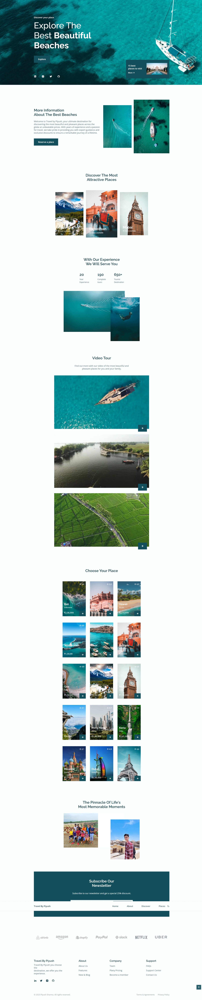
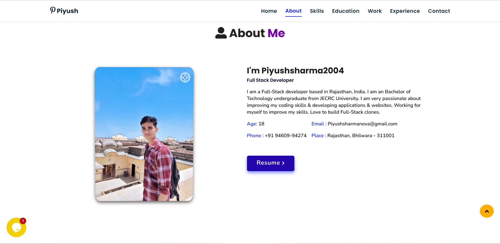
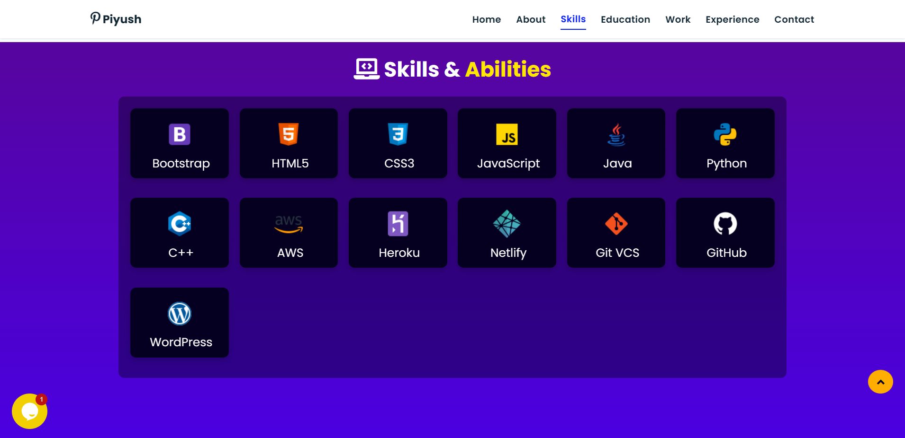
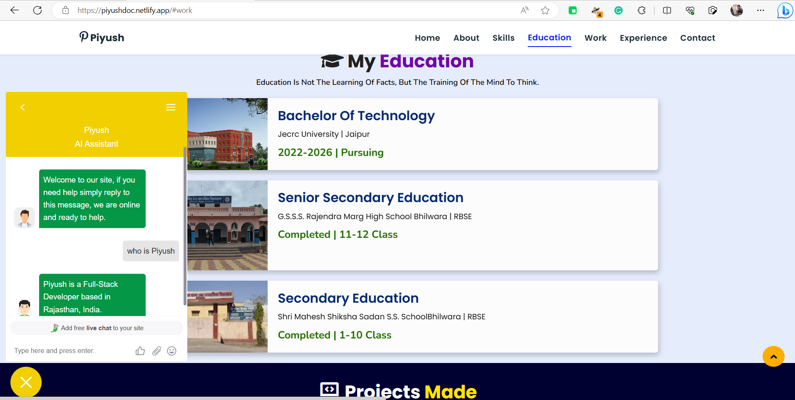
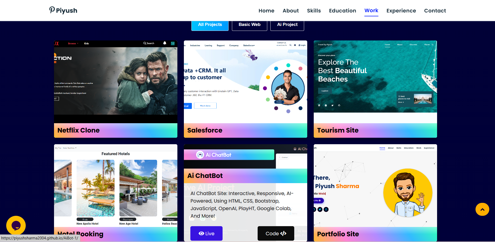
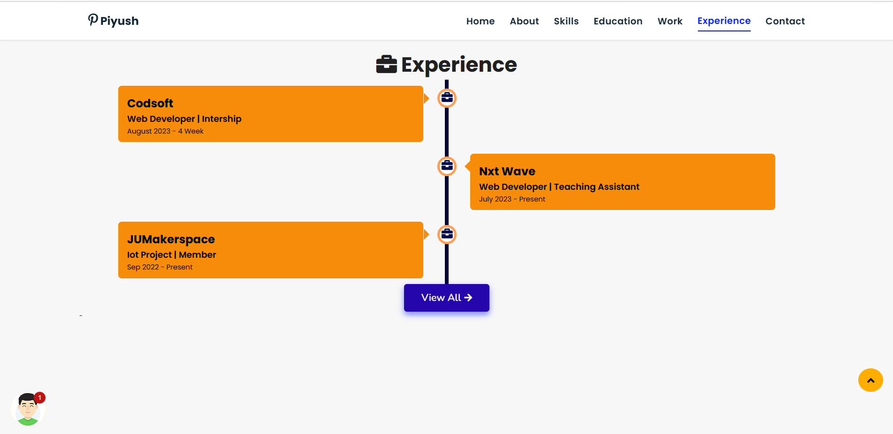
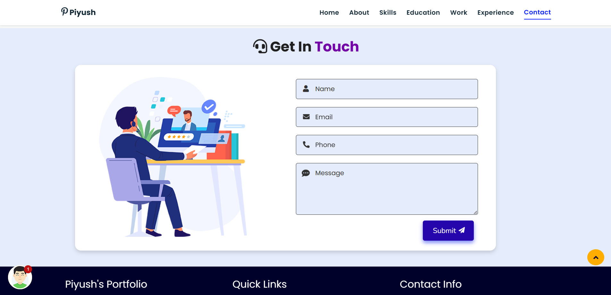

- Level 1 First website is Travel By Piyush (live) = https://travelbypiyush.netlify.app/
- Level 1 Portfolio (live) = project preview URL=https://piyushdoc.netlify.app/
- Other screenshots of the Portfolio website are at the bottom

- Travel By Piyush Website Screenshot 

